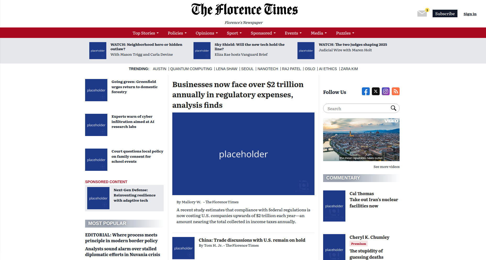

# The Florence Times

**The Florence Times** is a university project developed to replicate the structure and style of a real news website—specifically, *The Washington Times*. This project focuses on frontend development, accessibility best practices, and ethical content generation. It is not affiliated with or endorsed by *The Washington Times*.

---

## Features

- Fully responsive design mimicking a professional news site.
- Modern layout with sections for news articles, multimedia, and editorial content.
- Clean, semantic HTML and CSS structure.
- Accessibility-first approach with ARIA roles and screen reader support.

---

## Accessibility

The Florence Times was designed with accessibility as a core principle. The site includes:

- Proper use of semantic HTML5 elements.
- Full keyboard navigation support.
- ARIA labels and roles for dynamic content.
- Alt attributes for all images.
- Clear contrast and readable font sizes.
- Compatibility with screen readers such as NVDA and VoiceOver.

These features ensure that users of all abilities can navigate and consume content easily and effectively.

---

## Copyright & Content

All text, images, videos, and icons used in *The Florence Times* are **copyright-free**.  
They have been generated or sourced using **artificial intelligence tools** for educational purposes only.  
No copyrighted materials from *The Washington Times* or any other third-party source have been used.

---

## License

This project is licensed under the [MIT License](./LICENSE).  
You are free to use, modify, and distribute this project as long as you include the original license.

---
